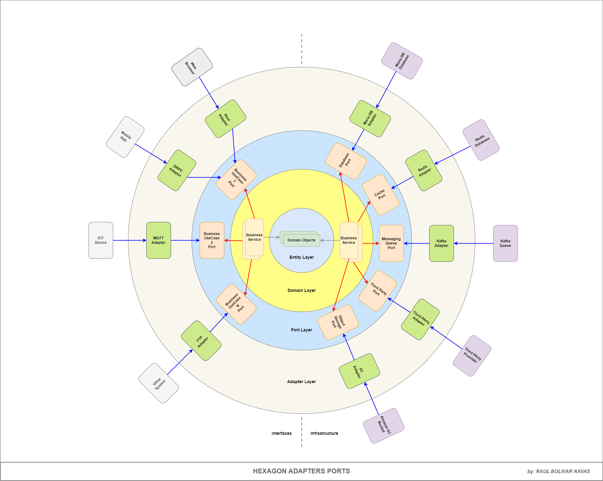
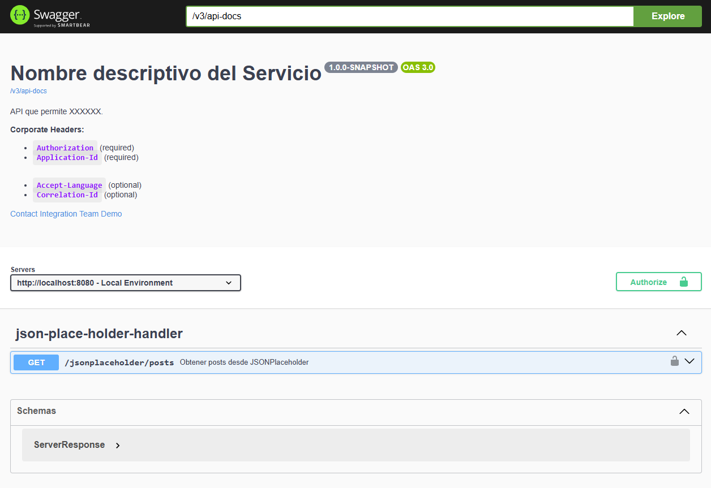

# Hexagonal Architecture with Adapters and Ports

Este servicio está diseñado siguiendo la arquitectura hexagonal (también conocida como arquitectura de puertos y adaptadores). Esta arquitectura permite una separación clara entre el núcleo de la aplicación y las dependencias externas, facilitando la mantenibilidad, escalabilidad y testabilidad del código.

### Reglas de dependencias:
- ***domain*** → **NO** depende de nadie.
- ***application*** → depende de domain.
- ***infrastructure:*** → dependen de application y domain.
- ***config*** → depende de todos (application, domain, infrastructure:*).
- ***boot*** → depende de config.

```text
hexagonal-architecture-adapters-and-ports
│
├─ settings.gradle
├─ build.gradle
│
├─ domain/
│  ├─ build.gradle
│  └─ src/main/java/com/demo/sd/sn/customer/domain/...
│
├─ application/
│  ├─ build.gradle
│  └─ src/main/java/com/demo/sd/sn/customer/application/...
│
├─ config/
│  ├─ build.gradle
│  └─ src/main/java/com/demo/sd/sn/customer/config/...
│
├─ infrastructure/
│  │ 
│  ├─ adapter-db/
│  │  ├─ build.gradle
│  │  └─ src/main/java/com/demo/sd/sn/customer/infrastructure/db/...
│  │
│  ├─ adapter-client/
│  │  ├─ build.gradle
│  │  └─ src/main/java/com/demo/sd/sn/customer/infrastructure/client/...
│  │
│  └─ adapter-rest/
│     ├─ build.gradle
│     └─ src/main/java/com/demo/sd/sn/customer/infrastructure/rest/...
│
└─ boot/
   ├─ build.gradle
   └─ src/main/java/com/demo/sd/sn/customer/boot/...
```

### Evolución a Clean + DDD táctico

Setup:
- DDD táctico
  - Entidades / Aggregates: Customer
  - Value Objects: CustomerId
  - Domain Services: CustomerDomainService
  - Repositorios (puertos): CustomerRepository, CreditScoreClient

- Clean Architecture / Hexagonal
  - Domain: centro de la arquitectura (domain/*)
  - Application: casos de uso (RegisterCustomerUseCase, commands/results)
  - Adapters:
    - DB: CustomerRepositoryAdapter (+ JPA)
    - Client: WebClientCreditScoreAdapter
    - API REST: CustomerController
  - Boot: composición/configuración, wiring de beans y arranque.

### Objetivo final:
- ***boot*** → solo main()
- ***config*** → TODOS los @Configuration, @Bean, WebClient, Datasource, UseCases
- ***domain*** → puro
- ***application*** → use cases
- ***infrastructure*** → adapters

### Diagrama:


### Como ejecutar:
1. Clona el repositorio:
   ```bash
   git clone https://github.com/raulrobinson/hexagonal-architecture-adapters-and-ports
   ```
2. Navega al directorio del proyecto:
   ```bash
   cd hexagonal-architecture-adapters-and-ports
   ```
3. Construye el proyecto usando Gradle:
   ```bash
   ./gradlew build
   ```
4. Ejecuta la aplicación:
   ```bash
   ./gradlew :boot:run
   ```

### Swagger / OpenAPI
Una vez que la aplicación esté en funcionamiento, puedes acceder a la documentación de la API REST en:
```
http://localhost:8080/webjars/swagger-ui/index.html
```



### Endpoints
- **Obtener los Posts**: `GET /jsonplaceholder/posts`
  - Cuerpo de la solicitud:
    ```text
    curl --location 'http://localhost:8080/jsonplaceholder/posts' \
        --header 'accept: application/json' \
        --header 'Source-Bank: 1' \
        --header 'Application-Id: 1'
    ```
    
    - Respuesta:
    ```json
    [
      {
          "userId": 1,
          "id": 1,
          "title": "sunt aut facere repellat provident occaecati excepturi optio reprehenderit",
          "body": "quia et suscipit\nsuscipit recusandae consequuntur expedita et cum\nreprehenderit molestiae ut ut quas totam\nnostrum rerum est autem sunt rem eveniet architecto"
      },
      {
          "userId": 1,
          "id": 2,
          "title": "qui est esse",
          "body": "est rerum tempore vitae\nsequi sint nihil reprehenderit dolor beatae ea dolores neque\nfugiat blanditiis voluptate porro vel nihil molestiae ut reiciendis\nqui aperiam non debitis possimus qui neque nisi nulla"
      },
      {
          "userId": 1,
          "id": 3,
          "title": "ea molestias quasi exercitationem repellat qui ipsa sit aut",
          "body": "et iusto sed quo iure\nvoluptatem occaecati omnis eligendi aut ad\nvoluptatem doloribus vel accusantium quis pariatur\nmolestiae porro eius odio et labore et velit aut"
      },
          ...
    ]
    ```    

### Author

- **[Raul R. Bolivar Navas](https://github.com/raulrobinson)**

### License

This project is licensed under the MIT License. See the [LICENSE](LICENSE) file for details.